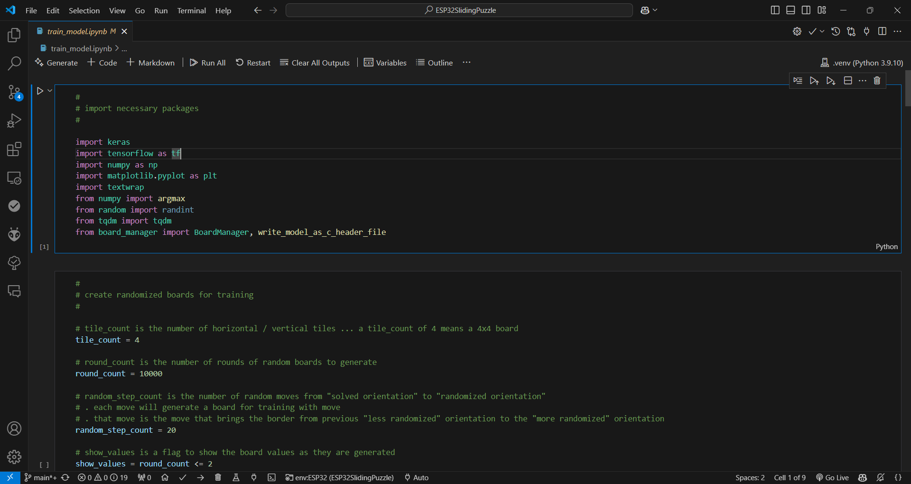

# Sliding Puzzle 'Next Move' Suggesting Naive DL Model with ESP32 TensorFlow Lite

This [project](https://github.com/trevorwslee/ESP32SlidingPuzzle) takes the game[Sliding Puzzle](https://github.com/trevorwslee/Arduino-DumbDisplay/blob/master/examples/sliding_puzzle_w_suggest/sliding_puzzle_w_suggest.ino)
(with simple 'next move' suggesting 'search-directed heuristic' option),
adding to it the capability of suggesting 'next move' with a ***naive*** DL model realized with ESP32 TensorFow Lite support.
The Sliding Puzzle game is implemented for Arduino framework compatible microcontroller with the help of [DumbDisplay](https://github.com/trevorwslee/Arduino-DumbDisplay)
to render the game remotely on your Android mobile phone.
Specifically, ESP32 / ESP32-S3 is the targe microcontroller for this experiment, since it not only supports Arduino framework, it also supports TensorFlow Lite.

|  |  |  |
|--|--|--|
||🤖<br>🤖<br>🤖<br>🤖<br>🤖<br>🤖<br>🤖<br>🤖<br>🤖<br>🤖<br>||

The DL model of this experiment is implemented with TensorFlow that I worked out by referencing to two of my previous experiments:
* [Trying Out TensorFlow Lite Hello World Model With ESP32 and DumbDisplay](https://www.instructables.com/Trying-Out-TensorFlow-Lite-Hello-World-Model-With-/)
* [Mnist Dataset -- From Training to Running With ESP32 / ESP32S3](https://www.instructables.com/Mnist-Dataset-From-Training-to-Running-With-ESP32-/)

Other than an ESP32 / ESP32S3 board, a few tools are assumed:
* Python 3
* Git
* VSCode and PlatformIO -- reference on how they are used: [A Way to Run Arduino Sketch With VSCode PlatformIO Directly](https://www.instructables.com/A-Way-to-Run-Arduino-Sketch-With-VSCode-PlatformIO/) 
* DumbDisplay Android App -- reference: [Blink Test With Virtual Display, DumbDisplay](https://www.instructables.com/Blink-Test-With-Virtual-Display-DumbDisplay/)


## Building DL Model with VSCode

First, clone this project's source from the project's [GitHub repository](https://github.com/trevorwslee/ESP32SlidingPuzzle)

```
git clone https://github.com/trevorwslee/ESP32SlidingPuzzle
```

Open the cloned directory `ESP32SlidingPuzzle` with VSCode, then open `train_model.ipynb`



Run all cells of the Jupyter Notebook `train_model.ipynb`.
If environment is not setup, it should first prompt you to create / select an Python environment. 


Create a virtual Python environment for the project


As the last step, when asked to install dependencies, ***make sure*** to select `requirement.txt`


This should create the Python virtual environment `.venv` for the project with the needed dependencies installed

# Enjoy!

Hope that you will have fun with it! Enjoy!

> Peace be with you!
> May God bless you!
> Jesus loves you!
> Amazing Grace!

