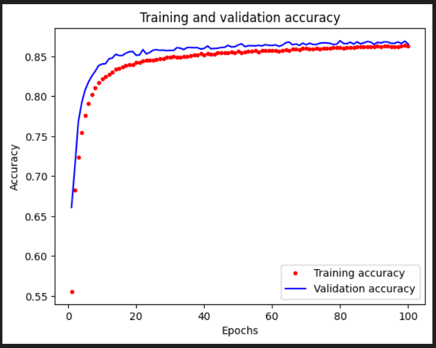

# Sliding Puzzle 'Next Move' Suggesting Simple DL Model with ESP32 TensorFlow Lite

This [project](https://github.com/trevorwslee/ESP32SlidingPuzzle) takes the game [Sliding Puzzle](https://github.com/trevorwslee/Arduino-DumbDisplay/blob/master/examples/sliding_puzzle_w_suggest/sliding_puzzle_w_suggest.ino)
(with simple 'next move' suggesting 'search-directed heuristic' option),
adding to it the capability of suggesting 'next move' with a ***simple and naive*** DL model realized with ESP32 TensorFow Lite support.
The Sliding Puzzle game is implemented for Arduino framework compatible microcontrollers with aids from [DumbDisplay](https://github.com/trevorwslee/Arduino-DumbDisplay)
to render the game remotely on your Android mobile phone.
Specifically, ESP32 / ESP32-S3 is the targe microcontroller for this experiment, since it not only supports Arduino framework, it also supports TensorFlow Lite.


|  |  |  |
|--|--|--|
||<br><br><br><br><br><br><br><br><br><br>||

The DL model of this experiment is implemented with TensorFlow that I worked out by referencing to two of my previous experiments:
* [Trying Out TensorFlow Lite Hello World Model With ESP32 and DumbDisplay](https://www.instructables.com/Trying-Out-TensorFlow-Lite-Hello-World-Model-With-/)
* [Mnist Dataset -- From Training to Running With ESP32 / ESP32S3](https://www.instructables.com/Mnist-Dataset-From-Training-to-Running-With-ESP32-/)

In addition to an ESP32 / ESP32S3 microcontroller board, a few tools are assumed:
* Python 3
* Git
* VSCode and PlatformIO -- reference on how they are used: [A Way to Run Arduino Sketch With VSCode PlatformIO Directly](https://www.instructables.com/A-Way-to-Run-Arduino-Sketch-With-VSCode-PlatformIO/) 
* DumbDisplay Android app -- reference: [Blink Test With Virtual Display, DumbDisplay](https://www.instructables.com/Blink-Test-With-Virtual-Display-DumbDisplay/)


# Building DL Model with VSCode

First, clone this project's source from the project's [GitHub repository](https://github.com/trevorwslee/ESP32SlidingPuzzle)

```
git clone https://github.com/trevorwslee/ESP32SlidingPuzzle
```

Open the cloned directory `ESP32SlidingPuzzle` with VSCode, then open `train_model.ipynb`


Run all cells of the Jupyter Notebook `train_model.ipynb`.
If environment is not setup already, it should first prompt you to create / select an Python environment. 


Create a virtual Python environment for the project


As the last step, when asked to install dependencies, ***make sure*** to select `requirement.txt`


This should create the Python virtual environment `.venv` for the project with the needed dependencies installed.

If all the cells completed successfully, the model C header file `src/esp32_sliding_puzzle/sp_model_4.h` will be generated, overwriting the one already there.
Yes, there is one already included with this project, and hence it is not necessary for you to train the model again, unless you would like to tune the DL model.

The DL model is ***naively*** constructed with Keras like 

```
tile_count = 4
batch_size = 128
epochs = 100
...
model = keras.models.Sequential()
model.add(keras.layers.Dense(256, activation='relu', input_shape=(tile_count * tile_count,)))
model.add(keras.layers.Dropout(0.3))
model.add(keras.layers.Dense(256, activation='relu'))
model.add(keras.layers.Dense(4, activation='softmax'))
...
model.compile(loss='categorical_crossentropy', optimizer=keras.optimizers.RMSprop(), metrics=['accuracy'])
history = model.fit(x_train, y_train, batch_size=batch_size, epochs=epochs, verbose=1, validation_data=(x_validate, y_validate))
```

With accuracy 0.868, the DL model appears not very good, but should be acceptable





# Building and Uploading the Sketch

As mentioned previously, although not necessary, the steps to build and update the sketch is via PlatformIO (an extension of VSCode).

The configurations for developing and building of the sketch are basically written down in the `platformio.ini` file
```
[env]
monitor_speed = 115200

[env:ESP32]
platform = espressif32
board = esp32dev
framework = arduino
board_build.partitions = huge_app.csv
monitor_filters = esp32_exception_decoder
lib_deps =
    https://github.com/trevorwslee/Arduino-DumbDisplay
    tanakamasayuki/TensorFlowLite_ESP32@^1.0.0
build_flags =
    -D FOR_ESP32

[env:ESP32S3]
platform = espressif32
board = esp32-s3-devkitc-1
framework = arduino
lib_deps =
    https://github.com/trevorwslee/Arduino-DumbDisplay
    tanakamasayuki/TensorFlowLite_ESP32@^1.0.0
build_flags =
    -D FOR_ESP32S3
```
Notice that you have choices of PlatformIO environments -- ***ESP32*** and ***ESP32S3***

Please choose the correct one according to the microcontroller board that you have.

In either case, the program entry point is `src/main.cpp`
```
#include <Arduino.h>

#if defined(CONFIG_IDF_TARGET_ESP32S3)
  #include "_secret.h"
#else
  #define BLUETOOTH "ESP32Sliding"
#endif

#include "esp32_sliding_puzzle/esp32_sliding_puzzle.ino"
```
Notice that
* For ESP32S3, WiFi connection to DumbDisplay Android app is used. In such a case, you will need to provide necessary WiFi login credentials in a header file `src/_secret.h` that you need to create with content like
  ```
  #define WIFI_SSID           "wifi-ssid"
  #define WIFI_PASSWORD       "wifi-password"
  ```
* Otherwise, for ESP32, Bluetooth connection to DumbDisplay Android app is used, with the Bluetooth device name `ESP32Sliding`  

Build and upload the sketch with VSCode menu item ***View | Command Palette***


For ESP32 which is using Bluetooth connectivity, you should see log entries with Serial Monitor (with baud rate 115200) like


For ESP32S3 which is using Wifi connectivity, the log entries will be like


Notice that the IP to connect to the ESP32 board shown by the log entries.

To connect your Android phone to your ESP32 / ESP32S3 microcontroller board via DumbDisplay Android app, open the DumbDisplay Android app and make connection like

| with Bluetooth  | add WiFi   | with Wifi |
|--|--|--|
||||

# Sliding Puzzle Game UI

| | |
|--|--|
|After connection, you should see the picture of the board drawn.||
|To start a game, double click on the board, to divide the board into grid of tiles||

Double clicking on the board will randomize the board by 5 steps (5 random moves).

During game play, you can click ***Suggest*** for a suggested 'next move'.
If you click ***Continuous***, suggested 'next moves' are continuously made until either you disabled ***Continuous*** or the puzzle is solved. 

There are three options for the 'next move' suggestion:
1) ***AI Only*** -- use the trained DL model for predicting 'next move' (the highest probability one)
2) ***AI+Search*** -- largely use the trained DL model for predicting 'next move'; however, if the top 'next move' probability is not high, fallback to use original "search* algo 
3) ***Search Only*** -- use original "search" algo only

After every solving of the puzzle, 5 more randomize steps are added to randomization making the game a bit harder.

# Improving the 'Next Move' Suggestion Accuracy

The 'next move' suggestion is certainly not very accurate, specially when the board is randomized for many steps.

* The ***naive*** DL model can certainly be improved.
  Notice that in`train_model.ipynb`, the training data is randomized in reverse of how a board is randomize.
  Hence, it make sense that the number of randomize steps affects the accuracy of the model specially in case the game is randomized for more steps than the model is trained.
  Here are the parameters for training the model:
  - `round_count` -- the number of rounds of random boards to generate; `10000` by default
  - `random_step_count` -- the number of random moves from "solved orientation" to "randomized orientation"; `20` by default  
* The "search" algo can be improved
* The DL + "search" can be improved

Moreover, the board size can be bigger, like 5x5.
In order to change the board size to 5:

1) Need to change `tile_count` of `train_model.ipynb` generate a `sp_model_5.h` for the sketch
   ```
   # tile_count is the number of horizontal / vertical tiles ... a tile_count of 4 means a 4x4 board
   tile_count = 4
   ```

2) Need to modify the sketch `esp32_sliding_puzzle.ino`
   ```
   #define TILE_COUNT              4
   ```
   which controls
   ```
    #if TILE_COUNT == 4
      #include "sp_model_4.h"
    #elif TILE_COUNT == 5
      #include "sp_model_5.h"
    #endif
    const tflite::Model* model = ::tflite::GetModel(sp_model);
   ```    


*Interested friends are encouraged to try out and share how the 'next move' suggestion can be improved.*


# Enjoy!

Hope that you will have fun with it! Enjoy!

> Peace be with you!
> May God bless you!
> Jesus loves you!
> Amazing Grace!

