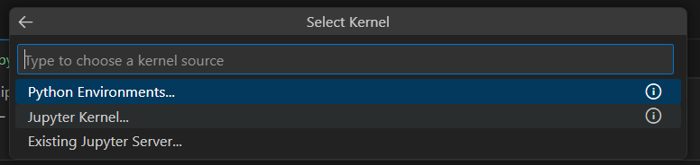

# Sliding Puzzle 'Next Move' Suggesting Naive DL Model with ESP32 TensorFlow Lite

This experiment takes the game [Sliding Puzzle](https://github.com/trevorwslee/Arduino-DumbDisplay/blob/master/examples/sliding_puzzle_w_suggest/sliding_puzzle_w_suggest.ino)
with very simple 'next move' suggesting 'search algorithm' adding to it the capability of suggesting 'next move' with a naive DL model realized with ESP32 TensorFow Lite support.

The Sliding Puzzle game is implemented for Arduino framework compatible microcontroller with the help of [DumbDisplay](https://github.com/trevorwslee/Arduino-DumbDisplay) to render the game remotely on your Android mobile phone.

Specifically, ESP32 / ESP32-S3 is the targe microcontroller for this experiment, since it not only supports Arduino framework, it also supports TensorFlow Lite.

The DL model of this experiment is built with TensorFlow referencing to two of my previous experiments
* [Trying Out TensorFlow Lite Hello World Model With ESP32 and DumbDisplay](https://www.instructables.com/Trying-Out-TensorFlow-Lite-Hello-World-Model-With-/)
* [Mnist Dataset -- From Training to Running With ESP32 / ESP32S3](https://www.instructables.com/Mnist-Dataset-From-Training-to-Running-With-ESP32-/)

Hence, a few tools are assumed:
* Python 3.
* VSCode
* PlatformIO


## Building DL Model with VSCode

Open `train_model.ipynb` with VSCode, and run all cells, it should first prompt to select an Python environment 




As the last step, when asked to install dependencies, it is important to select `requirement.txt`


This should create the Python virtual environment `.venv` for the project.


Assume Python 3.9+ installed and be able to be called from command prompt.

Use VSCode to open this project folder -- `ESP32SlidingPuzzle`

Open a terminal from VSCode and run the following to check the version of your install 
```
python --version
```

you should see something like
```
Python 3.9.10
```

Now, install an Python virtual environment or the project like
```
python -m venv venv
```

this will create a new syb-directory `venv`

For Windows environment, you can active the virtual environment like
```
.\venv\Scripts\activate
```

While the Python virtual environment for this project is activated, you install the required Python package by running
```
pip install -r .\requirements.txt
```

From now on, you should not be needing to use the terminal
